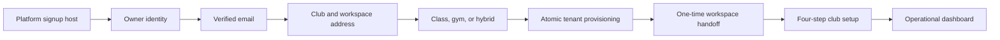

# SaaS Owner Signup And Workspace Onboarding

## Release Position

The owner signup implementation supports a controlled SaaS pilot for class
clubs, gym-access clubs, and hybrid clubs. It is deliberately disabled by
default:

```env
SAAS_SIGNUP_MODE="DISABLED"
```

Deploying the code or migrations does not expose public signup and does not
change the existing first tenant. Activate `INVITE_ONLY` only after the
infrastructure gate in this runbook passes. Activate `PUBLIC` only after the
invite pilot and legal review pass.

## Product Profiles

The signup edition selects product modules. The product profile is derived from
those modules and is never stored separately.

| Signup edition | Enabled modules | Resulting profile |
| --- | --- | --- |
| `CLASS` | `CLASS_MANAGEMENT` | `CLASS_ONLY` |
| `GYM` | `GYM_ACCESS` | `GYM_ONLY` |
| `HYBRID` | both modules | `HYBRID` |

Activity templates make the initial choice understandable without creating
fake business data:

- Dojo / martial arts.
- Yoga and wellness studio.
- Dance academy.
- Group fitness studio.
- Fitness gym.
- Martial arts and gym.
- Group classes and gym.
- Custom class or hybrid club.

Templates preselect onboarding suggestions only. The owner can change
disciplines before completion. Completion creates club settings and the chosen
disciplines, but no sample members, plans, payments, groups, or sessions.

## User Journey



The setup flow is intentionally short:

1. Club name, contact details, and working days.
2. Activity template and disciplines when classes are enabled.
3. Pointage and gym-access policies relevant to the selected edition.
4. Review and profile-specific next actions.

Gym-only onboarding never asks for a discipline, coach, group, schedule, or
session. Existing manually created tenants without a self-serve onboarding row
are never redirected into this flow.

## Security And Abuse Controls

- Signup routes are accepted only on `PLATFORM_APP_URL` / platform hosts.
- Tenant subdomains cannot execute platform signup requests.
- Email ownership is verified before a workspace can be provisioned.
- Verification codes are attempt-limited and short-lived.
- Signup, resend, verification, slug, and provisioning requests are rate
  limited.
- Public mode requires a shared Redis rate-limit backend.
- Cloudflare Turnstile and Google reCAPTCHA are supported through the same
  server-side anti-bot interface.
- reCAPTCHA action and minimum score are checked server-side.
- Invitation, verification, idempotency, handoff, and rate-limit values are
  HMAC-derived with `SIGNUP_TOKEN_SECRET`; raw invitation tokens are never
  stored.
- Tenant creation, first admin, subscription, modules, settings, onboarding,
  handoff token, and platform audit records are committed in one serializable
  transaction.
- The one-time workspace handoff is short-lived and host-only auth cookies are
  retained.
- Completed signup records clear their duplicate password hash and request
  fingerprint in the provisioning transaction.
- Expired trial access blocks operations but preserves all tenant data.
- Existing and manually managed SaaS subscriptions remain date-independent
  unless `automaticLifecycle` is explicitly enabled.

Use three different 32+ character secrets for `AUTH_SECRET`,
`ACCESS_CREDENTIAL_SECRET`, and `SIGNUP_TOKEN_SECRET`.

## Infrastructure Gate

Before changing signup mode from `DISABLED`:

1. Point `app.we-discipline.com` to the VPS and include it in the TLS
   certificate.
2. Configure wildcard DNS and TLS for `*.we-discipline.com` so a newly created
   tenant host works immediately.
3. Route the platform host and wildcard tenant hosts to the same application,
   preserving the original `Host` and `X-Forwarded-Host` values.
4. Set `PLATFORM_APP_URL`, `SAAS_PLATFORM_HOSTS`, and reserved slugs.
5. Configure a verified Resend sender for `SAAS_SIGNUP_FROM` and perform a real
   inbox delivery test.
6. Configure legal Terms and Privacy URLs. They are required whenever signup is
   enabled.
7. Keep one app replica with the explicit memory limiter, or configure shared
   REST Redis before using multiple replicas. Public mode always requires
   Redis.
8. Configure Turnstile or reCAPTCHA before public mode. Invite-only may use it
   too and should use it for any broadly shared invitation.
9. Run `npm run config:validate:production` inside the release environment.
10. Back up PostgreSQL, environment files, Nginx, uploads, and the current image
    before applying migrations.

## Environment Controls

The complete template is in `.env.production.example`. Important controls are:

```env
PLATFORM_APP_URL="https://app.we-discipline.com"
SAAS_PLATFORM_HOSTS="app.we-discipline.com"
SAAS_SIGNUP_MODE="DISABLED"
SAAS_SIGNUP_TRIAL_DAYS="14"
SAAS_SIGNUP_TRIAL_GRACE_DAYS="3"
SAAS_TERMS_URL="https://we-discipline.com/conditions"
SAAS_PRIVACY_URL="https://we-discipline.com/confidentialite"
NEXT_PUBLIC_SIGNUP_ANTI_BOT_PROVIDER="TURNSTILE"
```

Supported modes:

- `DISABLED`: platform signup returns an unavailable response. This is the
  deployment default.
- `INVITE_ONLY`: a valid, unexpired, unrevoked operator-issued token is
  required.
- `PUBLIC`: no invitation is required, but shared Redis and Turnstile or
  reCAPTCHA are mandatory.

## Invitation Operations

Run every mutation as an identified operator and start with a dry-run.

```bash
npm run signup:invite -- create \
  --edition CLASS \
  --email owner@example.com \
  --templates martial-arts-dojo \
  --expires-in-days 7 \
  --max-uses 1 \
  --operator hwidifiras \
  --dry-run
```

Repeat without `--dry-run` after reviewing the preview. The command prints the
signup URL once. Send it through a trusted channel; it cannot be recovered from
the database.

```bash
npm run signup:invite -- list --operator hwidifiras
npm run signup:invite -- inspect --id <invite-id> --operator hwidifiras
npm run signup:invite -- revoke --id <invite-id> --operator hwidifiras --dry-run
```

Invitation creation and revocation are recorded in append-only platform audit
logs. Revoked links are not re-enabled; issue a new link instead.

## Trial Lifecycle

Self-serve workspaces use `automaticLifecycle = true`:

1. The trial operates until `trialEndsAt`.
2. Owners see a countdown during the last seven days.
3. The optional grace window operates until `graceEndsAt`.
4. After grace, all staff mutations and private operational pages are blocked.
5. The subscription status and account recovery surfaces remain available.
6. No member, payment, receipt, attendance, visit, or audit history is deleted.

Commercial activation is still manual in this release. Use the audited
`saas:control` command from `docs/SAAS-SUBSCRIPTION-CONTROL.md`. Online checkout
and billing webhooks remain a later integration.

## Data Retention

Completed signup rows no longer retain a duplicate password hash. Run the
retention command periodically; it is a dry-run unless `--apply` is present.

```bash
npm run signup:prune -- --operator hwidifiras
npm run signup:prune -- --operator hwidifiras --apply
```

Defaults:

- Incomplete expired workflows: 30 days.
- Completed signup workflow metadata: 90 days.
- Used or expired one-time handoff tokens: 7 days.

The command never deletes a tenant, user, subscription, payment, receipt, or
club record and writes an append-only platform audit entry when applied.

## Access Media Compatibility

Gym access is designed around a credential medium rather than a QR-only model.
The current schema supports:

- Signed QR codes.
- Signed barcodes and keyboard/USB scanners.
- NFC tags.
- RFID cards.
- RFID wristbands.

External hardware identifiers are hashed; only a safe hint is displayed.
Denied scans do not retain a raw unknown credential. New readers or turnstiles
should integrate at the check-in boundary and reuse the existing access-policy
and append-only visit ledger, not bypass them.

## Controlled Rollout

### Stage 1: Disabled deployment

1. Deploy migrations and code with `SAAS_SIGNUP_MODE=DISABLED`.
2. Verify the existing first tenant remains `LEGACY_ACTIVE` or keeps its current
   manually controlled subscription.
3. Smoke-test login, dashboard, members, enrollment, payment, pointage,
   planning, receipts, and logout.

### Stage 2: Invite-only pilot

1. Seed and verify Class, Gym, and Hybrid SaaS plans.
2. Set `INVITE_ONLY`, restart the app, and validate production config.
3. Create one single-use invitation per edition.
4. Complete signup, email verification, handoff, and onboarding on real cloud
   hosts.
5. Verify the class tenant has no gym navigation, the gym tenant has no class
   dependencies, and the hybrid tenant has both with one member/finance model.
6. Let the test trial enter warning, grace, and blocked states on disposable
   tenants.

### Stage 3: Public signup

Public mode is a separate business decision. Require all of the following:

- Invite-only pilot accepted on desktop and real phones.
- Terms and Privacy content legally reviewed.
- Verified sender reputation and monitored email delivery.
- Shared Redis active.
- Turnstile or reCAPTCHA active and observed.
- Support and commercial conversion process staffed.
- Monitoring and alerts for signup errors, email failures, provisioning
  failures, rate-limit pressure, and database capacity.

## Rollback

To stop new signups immediately, set:

```env
SAAS_SIGNUP_MODE="DISABLED"
```

Then restart the app. Existing tenants and trials continue to work. If a
release rollback is required, switch the application image/Nginx target back to
the previous verified version and restore PostgreSQL only when migration
verification proves that a database rollback is necessary. Never delete newly
created tenant data as a rollback shortcut.

## Explicitly Deferred

- Online SaaS checkout, invoices, and provider webhooks.
- Public tenant cancellation and self-service plan changes.
- Enforced plan user/member limits.
- Multi-location tenants.
- Turnstile, RFID reader, or gate-vendor hardware drivers.
- Member mobile application and member self-service signup.

These are extension points, not prerequisites for a controlled invite-only
pilot.
