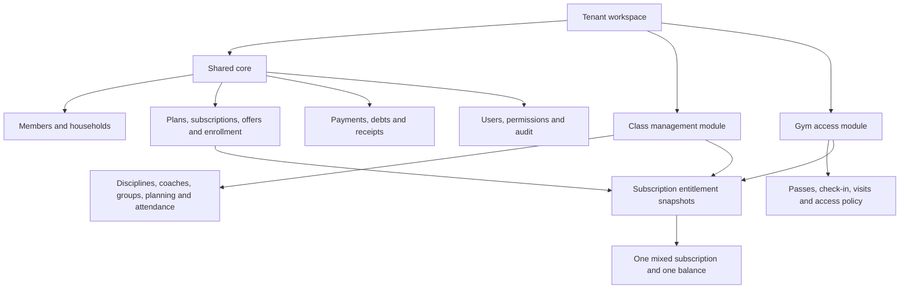

# Modular SaaS Product Readiness Audit - 2026-08-15

## Objective

Evaluate whether We Discipline can be sold in three configurations without behaving like three unrelated products:

1. Class / martial-arts management only.
2. Gym membership and access management only.
3. Combined classes plus gym, including mixed packages and shared operations.

This audit covers the current domain model, module gates, navigation, setup, sales, subscriptions, payments, attendance, gym access, member profiles, reporting, permissions, tenancy, SaaS packaging, tests, and code structure.

## Evidence And Scope

- Production currently serves the PostgreSQL SaaS stack from commit `7107811` on `127.0.0.1:3002`.
- The local branch is `codex/gym-module-entitlements` at the same commit, but it contains a large uncommitted hardening pass across 79 tracked files plus three new migrations.
- The local hardening work is not deployed and must not be mixed into module work until it is reconciled and committed.
- Fresh browser capture was unavailable in this audit session. Visual observations use the saved, authenticated gym QA evidence in `docs/audits/gym-module-qa-2026-07-12/` and current source structure. The saved screenshots still match the relevant navigation and setup code.
- No production data was changed.

## Executive Verdict

The codebase has a credible shared commercial foundation, but it does not yet have a true modular product architecture.

The current product is best described as:

> A martial-arts / class-management application with an optional gym access add-on.

It is not yet:

> One SaaS platform that can compose a class-only product, a gym-only product, or a combined product from the same shared core.

The strongest reusable parts are already present:

- PostgreSQL multi-tenancy and tenant-scoped records.
- Shared members, payments, receipts, offers, users, settings, and audit logs.
- Append-only payment corrections and reversals.
- Verifiable receipt snapshots.
- `PlanEntitlement` and immutable `SubscriptionEntitlement` snapshots.
- Separate class attendance and gym visit ledgers.
- Tenant opt-in for `GYM`.

The main problem is composition. `GYM` is optional, but class management is assumed to be permanently enabled. Navigation, setup, dashboards, imports, permissions, reports, and member screens are therefore still class-first.

### Current sellability

| Configuration | Current readiness | Verdict |
| --- | ---: | --- |
| Controlled martial-arts pilot, primarily admin-operated | 8/10 | Viable for the existing first client after normal release checks |
| Martial-arts tenant with real reception and coach accounts | 6/10 | Permission and coach-identity fixes required |
| Gym-only tenant | 4/10 | Not ready to sell as a standalone gym product |
| Combined tenant | 5.5/10 | Data foundation works, but sales and daily UX remain incomplete |
| Self-serve SaaS subscription product | 3/10 | Tenant isolation exists; platform billing and provisioning do not |

## Target Product Model

The product should have an implicit shared core and two independently enabled operational modules.



Recommended internal module keys:

- `CLASS_MANAGEMENT`
- `GYM_ACCESS`

Recommended derived product profiles:

- `CLASS_ONLY`: class enabled, gym disabled.
- `GYM_ONLY`: class disabled, gym enabled.
- `HYBRID`: both enabled.

The profile should be derived from enabled modules. Do not store a second profile field that can disagree with module state.

`CLASS_MANAGEMENT` is a better internal boundary than `MARTIAL_ARTS`: it supports martial arts today and can also support group fitness later. User-facing labels can remain martial-arts specific through templates and copy.

## What Must Be Preserved

Do not rewrite these foundations:

- `Tenant`, host resolution, auth freshness, and tenant-scoped database access.
- `Member` as one identity shared by classes and gym.
- `MemberSubscription` as one commercial agreement.
- `PlanEntitlement` as the definition of what a plan grants.
- `SubscriptionEntitlement` as the immutable snapshot of what was sold.
- `Payment`, `Receipt`, and their correction / verification behavior.
- `Attendance` for class consumption.
- `GymVisit` for gym admission and reversal.
- Existing routes where practical.
- Existing UI primitives, responsive tables, page headers, form sections, and shell data provider.
- Existing first-client IDs, dates, balances, receipts, attendance, and audit history.

## Critical Findings

### P0.1 - The local hardening branch is not releasable yet

The current dirty workspace validates at the Prisma level and lint has no errors, but the production build fails:

- `src/app/api/attendances/sessions/[id]/finalize/route.ts` removed the `prisma` import while leaving direct `prisma` calls.
- Five idempotency imports in the same file are unused, indicating an incomplete conversion.

The module roadmap must start by finishing or isolating this existing work. Building new module changes on top of an unbuildable, uncommitted branch would make review and rollback unreliable.

### P0.2 - Module state is one-sided

`TenantModuleKey` contains only `GYM`. No class module exists, so all class routes are always available.

Effects for a gym-only tenant:

- Sidebar still shows Pointage, Planning, Groupes, Coachs, and Disciplines.
- Mobile bottom navigation still prioritizes Pointage instead of Acces salle.
- Setup guide starts with discipline, coach, and group creation.
- Settings hub presents class schedules and coaching as required configuration.
- Dashboard runs class session and finalization queries and shows empty class states.
- Class APIs remain reachable if the user has their permission.

The saved gym desktop QA screenshot visibly shows both the gym check-in page and a setup prompt to create a discipline. This is direct evidence that module composition is incomplete.

### P0.3 - Reception permissions do not match reception workflows

The reception preset grants:

- `members.manage`
- `enrollment.manage`
- `attendance.manage`
- `payments.manage`

The class enrollment wizard also reads:

- `/api/groups`, guarded by `catalog.manage`.
- `/api/subscription-plans`, guarded by `catalog.manage`.
- `/api/offers`, guarded by `offers.manage`.

The gym / mixed enrollment POST uses `/api/member-subscriptions`, also guarded by `catalog.manage`.

Therefore a normal limited reception account can be allowed into `/enrollment` but denied the data or mutation required to complete it. This is a product-level authorization mismatch.

Required correction:

- Separate the ability to sell from the ability to configure the catalog.
- Add an enrollment context read service authorized by `enrollment.manage`.
- Authorize subscription creation through `enrollment.manage`.
- Keep plan creation, plan correction, discipline configuration, and group configuration under catalog management.
- Add module-aware presets such as Reception classes, Reception gym, Reception hybrid, Coach, and Manager.

### P0.4 - Future gym renewals can interrupt current access

`createSubscriptionFromPlan()` closes overlapping active subscriptions as soon as a gym or mixed subscription is created. The new subscription is stored as `ACTIVE` even when its start date is in the future.

For gym access, the policy only accepts entitlements whose parent subscription is `ACTIVE`. A future renewal can therefore expire the current gym pass immediately while the new pass is not date-active yet.

Required correction:

- Introduce one canonical subscription lifecycle resolver.
- Do not supersede the current right before the replacement start date.
- Support queued renewal with `renewsSubscriptionId` or an equivalent link.
- Derive effective state as scheduled, active, expired, or cancelled from lifecycle plus dates.
- Define overlap policy explicitly for each entitlement type.
- Add first-use activation only as an optional gym plan policy; keep mixed plans date-based in the first release.

### P0.5 - Class and gym enrollment are two unequal products

Class sales use `EnrollmentWizard`, while gym and mixed sales use `SubscriptionAddForm`.

The class flow has:

- Quote calculation.
- Offer selection.
- Multi-line and household handling.
- Payment reasoning.
- Receipt completion actions.
- Immediate undo / recovery support.

The gym / mixed flow has:

- Direct plan and member selection.
- Initial payment.
- Mixed group assignment.
- No offer selection despite `OfferPlanScope` supporting gym and mixed plans.
- No equivalent completion screen or receipt action, although the backend issues a receipt.
- No enrollment undo flow.
- Copy such as `Renouveler` even when creating a first subscription.

Required correction:

- Build one sale engine and one guided enrollment shell.
- Keep class, gym, and mixed adapters only for entitlement-specific choices.
- Use the same quote, offer, payment, receipt, recovery, and completion services for every plan kind.

### P0.6 - Sold gym and mixed rights cannot be corrected safely

The subscription correction screen edits legacy `remainingSessions`. Gym and mixed subscriptions store zero there, while real balances live in entitlement snapshots.

The API blocks changing a gym or mixed plan and tells staff to cancel and recreate it, but the UI still exposes generic plan and session controls. There is no traced manual correction for a sold gym visit quota or a mixed class entitlement.

Required correction:

- Make the correction UI entitlement-aware.
- Add append-only `EntitlementAdjustment` rows with entitlement, signed units, reason, actor, timestamp, and source.
- Use replacement / cancellation for a wrongly sold plan rather than mutating historical snapshots.
- Keep the original payment and receipt history linked.

### P0.7 - Module protection is scattered

Gym checks are spread across pages, APIs, form options, account payloads, and navigation. Class routes have no equivalent module gate.

Required correction:

- Add a request-scoped `getTenantProductContext()`.
- Resolve enabled modules once per request / shell load.
- Use one route metadata registry for module requirement, permission requirement, navigation placement, and labels.
- Enforce module access in server pages and APIs, not only in visible navigation.
- Return a safe unavailable page for disabled modules.
- Never use a cross-request global cache for tenant product context.

## Three Product Experiences

### 1. Class-only / martial-arts tenant

Keep:

- Disciplines and common martial-art templates.
- Coaches and qualifications.
- Groups, demographic policies, schedules, sessions, conflicts, postponement, and finalization.
- Class enrollment, attendance, recovery policy, session quotas, and group reports.
- Shared finance, receipts, members, households, offers, users, and logs.

Improve before wider sales:

- Fix reception permissions.
- Link staff coach accounts to a `Coach` record and restrict coach views to their assigned groups unless granted broader access.
- Make class setup profile-aware and guided.
- Replace fixed `sessionsPerWeek * 4` assumptions with explicit granted units or validity-aware templates.
- Keep belts / grades, documents, and competitions as later martial-specific enhancements, not blockers for the operational MVP.

### 2. Gym-only tenant

The first screen should be gym operations, not a stripped martial dashboard.

Required daily navigation:

- Accueil.
- Acces salle.
- Inscrire.
- Encaisser.
- Abonnements.
- Membres.
- Historique des acces.
- Historique caisse.
- Reglages.

Hide completely:

- Class pointage.
- Planning.
- Groupes.
- Coachs.
- Disciplines.
- Class attendance history and group reports.
- Class setup steps and class data alerts.

Required gym capabilities before selling:

- Real member access code, QR, or card identifier, unique per tenant.
- Fast scan behavior with autofocus and automatic lookup, not only a manual search button.
- Idempotent retry that can replay the original successful scan result.
- Pass activation and safe future renewal.
- Pause / freeze with reason and a defined end-date policy.
- Opening days and opening hours, shared with the club but enforceable by gym access policy.
- Access attempts ledger for denied as well as admitted passages.
- Visit correction and quota restoration, already substantially present.
- Gym member import without requiring discipline or group columns.
- Visit history pagination, search, filters, and export.
- Expiring-pass and debt queues.
- Compact gym reports: visits by day/hour, active passes, expiring passes, sales by pass, denied entries, exceptional admissions, and renewals.

Do not delay the first gym release for workout programs, body measurements, equipment maintenance, personal-training booking, or hardware turnstile integration. Sell the first gym edition honestly as membership, access, and finance management.

### 3. Hybrid tenant

The hybrid product must merge commercial and identity concerns while keeping consumption separate.

Shared:

- One member profile.
- One subscription for a mixed package.
- One amount, balance, payment history, and receipt.
- One enrollment quote and completion flow.
- One renewal queue.
- One audit trail.

Separate:

- Class sessions consume only the matching class entitlement.
- Gym visits consume only the gym entitlement.
- Class schedule rules never affect gym entry unless explicitly configured.
- Gym denial or duplicate-scan policy never affects class attendance.

Hybrid dashboard:

- Today classes and finalization.
- Gym entries and denied admissions.
- Shared cash and debt.
- Expiring class, gym, and mixed rights.
- Member segmentation: class only, gym only, and both.
- Revenue by plan kind without splitting a single mixed payment incorrectly.

## Shared Product Changes

### Navigation and shell

Replace hard-coded section arrays with a capability registry. Each item should declare:

- route;
- label;
- icon;
- required module;
- required permission;
- product-profile placement;
- mobile priority;
- optional badge loader.

The shell should build navigation from tenant product context plus current user permissions. The same registry should drive server route guards.

### Dashboard

Product profile and user mode are separate axes:

- Product profile: class-only, gym-only, hybrid.
- User mode: reception, pilotage, coach.

Current `RECEPTION` / `PILOTAGE` support should be retained. Widget resolution should consider both axes so a gym reception user gets gym access work first and a class coach gets only their relevant sessions.

Avoid running class dashboard queries for gym-only tenants. Split the current 1,321-line page into shared finance/member read models and small module widget providers.

### Setup and settings

Replace the fixed five-step class guide with profile-aware journeys.

Shared setup:

1. Club identity, time zone, currency, opening days, and receipt identity.
2. Staff and role presets.
3. Import or first member.
4. Payment and access policy.

Class setup:

1. Discipline template.
2. Coach.
3. Group and room.
4. Weekly schedule.
5. Class formula.
6. Test enrollment and pointage.

Gym setup:

1. Opening hours and access rules.
2. Unlimited or quota pass.
3. Member access-code format.
4. Test subscription and check-in.

Hybrid setup:

- Shared steps plus both module journeys.
- Mixed-package creation is optional, not a blocker to finish setup.

The settings hub and club settings page should render only relevant module sections. Keep typed settings columns for now; split the UI and services before considering separate settings tables.

### Member profile

Use one conditional profile with shared and module tabs:

- Overview: debt, active rights, expiry, last activity, next action.
- Classes: groups, class entitlements, attendance, remaining sessions.
- Gym: pass, remaining visits, last entry, visit history, access code.
- Payments and receipts.
- Audit / corrections for authorized staff.

Do not show empty class history to a gym-only tenant or empty gym sections to a class-only tenant.

### Plans and entitlements

Keep `PlanKind` and entitlement snapshots. Make entitlements the canonical source for all new behavior.

Legacy compatibility fields currently duplicate business truth:

- `SubscriptionPlan.sportId`
- `SubscriptionPlan.sessionsPerWeek`
- `SubscriptionPlan.totalSessions`
- `MemberSubscription.sportId`
- `MemberSubscription.remainingSessions`

Migration strategy:

1. Keep these columns during compatibility.
2. Backfill and verify all entitlement snapshots.
3. Convert reads, renewals, corrections, sorting, notifications, reports, and badges to entitlements.
4. Dual-write only where old class code still requires it.
5. Add monitoring for mismatches.
6. Remove legacy writes, then remove columns in a later release.

Do not remove them in the first modular migration.

### Imports and exports

Current bulk import deliberately filters to `CLASS` plans and requires a group. Add separate templates:

- Class members: member, discipline, group, plan, validity, balance, remaining sessions.
- Gym members: member, pass, start/end, paid amount, remaining visits, optional access code.
- Hybrid members: one member plus one or more entitlement rows, with a guided preview.

Add tenant self-exports for members, subscriptions, payments, class attendance, and gym visits. This is a trust and portability feature for paid SaaS clients.

### Notifications and badges

Current expiry and debt notifications are mostly reusable, but permissions and renewal logic are not module-aware. Gym and mixed subscriptions have legacy `remainingSessions = 0`, which makes the navigation renewal badge treat them as low-session subscriptions.

Required behavior:

- Compute low balance from entitlement type.
- Unlimited gym access has no low-unit warning.
- Quota passes use remaining gym units.
- Mixed plans evaluate each right and show the right that needs action.
- Class finalization alerts run only when class management is enabled.
- Gym denied-entry and expiring-pass alerts run only when gym access is enabled.

### Time, locale, and money

Money is currently fixed to TND, which is acceptable for a Tunisia-first release. Time zone is process-wide (`Africa/Tunis`) and the receipt component still formats with `Europe/Paris`.

Before multi-country sales:

- Add `timeZone` and `currencyCode` to tenant settings.
- Use the tenant time zone in gym day limits, dashboards, receipts, sessions, and reports.
- Keep TND as the migration default.
- Avoid local server `setHours()` boundaries in gym history and policy code.

For Tunisia-only pilots, fixing receipt and gym date handling to the existing app time zone is P0; configurable currency can remain later.

## SaaS Subscription Packaging

Club-member subscriptions and the SaaS tenant subscription are different domains and must not share a model name or service.

Add a platform-level model such as:

- `SaasPlan`: slug, name, price, billing interval, active state, limits.
- `SaasPlanModule`: modules included by the platform plan.
- `TenantSaasSubscription`: tenant, SaaS plan, status, trial end, current period end, grace end, external billing reference.
- `TenantModuleGrant`: effective module, source, enabled / disabled state, timestamps.

Suggested SaaS statuses:

- `TRIAL`
- `ACTIVE`
- `PAST_DUE`
- `GRACE_PERIOD`
- `SUSPENDED`
- `CANCELLED`

For the first manually sold clients, an audited platform script or small super-admin console can manage these records. Online checkout and payment-provider webhooks can follow later. Do not expose self-serve signup until server-side plan validation, tenant provisioning, first-admin creation, email verification, and subscription enforcement all exist.

## Permission Model

The current `ADMIN` / `STAFF` model can remain, but permissions need business intent instead of broad route ownership.

Recommended first refinement:

- `members.manage`
- `enrollment.sell`
- `payments.collect`
- `payments.correct`
- `subscriptions.correct`
- `class.attendance`
- `class.manage`
- `gym.checkin`
- `gym.correct`
- `gym.manage`
- `offers.manage`
- `reports.finance`
- `settings.manage`

At minimum, split catalog configuration from enrollment reads and sales.

Add optional `User.coachId` so a coach account can be tied to a domain coach. Without that link, a user labelled Coach is only a staff account with attendance permission and is not naturally limited to their own groups.

## Gym Access Policy Improvements

Keep the current allowed-access policy, advisory locking, quota decrement, duplicate window, daily limit, exceptional reason, and reversal ledger.

Correct or add:

- Select the most relevant denied pass, not simply the oldest entitlement.
- Batch member search decisions; current search can run policy queries repeatedly for up to ten results.
- Add a denied-attempt ledger.
- Add idempotent scan replay, including unlimited passes.
- Use tenant-aware day boundaries.
- Restrict exceptional override by permission and configurable reason categories.
- Decide whether an override may bypass expiry, debt, quota, daily limit, or duplicate scan independently.
- Store and search a real member access credential.

## Reporting Required For Sale

### Shared finance

- Sales and collections by period.
- Outstanding balances and aging.
- Discounts and corrections.
- Receipts issued, voided, and missing.
- Revenue by plan and plan kind.

### Class module

- Attendance rate by group and discipline.
- Sessions delivered, cancelled, and awaiting finalization.
- Capacity and group utilization.
- Remaining-session and renewal queue.

### Gym module

- Visits today and by hour/day.
- Active, expiring, exhausted, frozen, and unpaid passes.
- Denied and exceptional admissions by reason.
- Sales and renewals by gym pass.
- Unique visitors and repeat frequency.

### Hybrid

- Class-only, gym-only, and combined members.
- Mixed-package sales.
- Cross-sell opportunities.
- Rights needing renewal without double-counting a single subscription or payment.

## Code Structure Strategy

Do not perform a big-bang folder rewrite. Extract services while implementing each product checkpoint.

Recommended boundaries:

```text
src/platform/product/        tenant modules, SaaS plan, capability registry
src/modules/core/            members, users, settings, audit
src/modules/sales/           plans, entitlements, enrollment, renewal
src/modules/finance/         payments, debt, receipts
src/modules/classes/         disciplines, groups, sessions, attendance
src/modules/gym/             access policy, visits, gym reports
```

Priority god files to split as touched:

| File | Approx. lines | Extraction direction |
| --- | ---: | --- |
| `src/app/page.tsx` | 1,321 | dashboard composition plus module read models |
| `src/app/api/attendances/route.ts` | 1,101 | create, correct, delete handlers plus attendance service |
| `src/app/api/member-subscriptions/route.ts` | 842 | query, sale, correction, cancellation services |
| `src/components/sessions/sessions-planner.tsx` | 791 | filters, week grid, session card, detail panel |
| `src/lib/membership-rules.ts` | 720 | assignment, quote, offer, and attendance subscription policies |
| `src/components/enrollment/enrollment-wizard.tsx` | 593 | shared sale state plus plan-kind adapters |

Rules for refactoring:

- Keep route handlers thin.
- Put transactions in domain services, not React components.
- Put access decisions in policy functions with explicit input and output.
- Keep Prisma reads tenant-explicit even with the tenant extension.
- Avoid generic `utils.ts` dumping grounds.
- Do not create a plugin framework; a typed module registry is enough.

## Safe Implementation Roadmap

### Checkpoint 0 - Reconcile the current dirty hardening pass

Goal: return to a reviewable, releasable baseline before module work.

- Inventory every local modified file and assign it to hardening, performance, or accidental change.
- Fix the current TypeScript build failure.
- Complete or remove the half-applied finalization idempotency conversion.
- Run fresh migration, lint, typecheck, tests, and build on a disposable PostgreSQL database.
- Commit hardening in coherent chunks.
- Deploy it separately from product-module behavior.

Exit gate: clean branch, green build, green disposable-DB suite, production smoke check.

### Checkpoint 1 - Introduce symmetric product modules

- Add `CLASS_MANAGEMENT` while preserving `GYM_ACCESS` / existing GYM data.
- Backfill every existing tenant with class management enabled.
- Preserve the first tenant's current gym module state exactly.
- Add `getTenantProductContext()` and derived profile.
- Add centralized module route guards and capability metadata.
- Keep current UI behavior for the existing tenant during this checkpoint.

Exit gate: no first-client page, count, balance, or permission changes.

### Checkpoint 2 - Fix permissions and role presets

- Separate sale/read permissions from catalog configuration.
- Add module-aware staff presets.
- Make class, gym, and mixed enrollment work for a limited reception account.
- Add coach-to-user identity or explicitly defer coach accounts from sales claims.

Exit gate: each preset completes only its intended workflows and is denied everywhere else.

### Checkpoint 3 - Unify sale, renewal, offers, and receipt completion

- Create one sale service and one enrollment state model.
- Reuse quote, discount, payment, receipt, and recovery behavior for all plan kinds.
- Add queued renewal and safe overlap handling.
- Return receipt metadata from gym / mixed sales and show the completion actions.
- Add entitlement-aware correction and replacement flows.

Exit gate: class, gym, and mixed packages pass the same sale matrix.

### Checkpoint 4 - Deliver a real gym-only edition

- Dynamic navigation, mobile nav, setup, settings, dashboard, member profile, import, notifications, and reports.
- Add member access code / QR.
- Add denied-attempt ledger, opening hours, pause / freeze, scan idempotency, and visit exports.
- Remove all class empty states and class configuration from a gym-only workspace.

Exit gate: a new gym tenant can be configured, imported, sold, checked in, corrected, renewed, and reported without creating a discipline, coach, group, or session.

### Checkpoint 5 - Deliver the hybrid edition

- Unified member profile and operational dashboard.
- Mixed enrollment through the shared sale engine.
- Module-specific consumption and correction.
- Combined reports and renewal queue without double-counting.

Exit gate: one mixed package, one payment, and one receipt grant independent class and gym rights that cannot consume each other.

### Checkpoint 6 - Add platform SaaS subscription control

- Platform plans, tenant SaaS subscription status, module grants, limits, and audited provisioning.
- Manual super-admin workflow first.
- Grace-period and suspension behavior.
- Self-serve signup and provider webhooks only after manual onboarding is stable.

Exit gate: changing a tenant's purchased SaaS plan changes only authorized modules, preserves data, and has an immediate rollback path.

## Release Test Matrix

Every checkpoint must test all three profiles, not only the newly edited flow.

### Module isolation

- Class-only tenant cannot see or call gym routes.
- Gym-only tenant cannot see or call class routes.
- Hybrid tenant can use both.
- A disabled or suspended SaaS module preserves data but denies operations safely.
- Tenant A cannot guess Tenant B module, member, plan, subscription, payment, attendance, entitlement, or visit IDs.

### Sales and lifecycle

- New class, gym, and mixed sale.
- Full, partial, zero initial payment.
- Offer application for each plan kind.
- Receipt print, email, and public verification.
- Future renewal does not interrupt current rights.
- Cancellation, replacement, correction, and recovery preserve history.
- Amount can never fall below paid total.

### Consumption

- Class attendance consumes only its matching class entitlement.
- Absence follows tenant policy.
- Gym unlimited visit consumes no units.
- Gym quota visit consumes exactly one unit.
- Reversal restores exactly one unit.
- Mixed gym visit never changes class units.
- Mixed class attendance never changes gym units.
- Duplicate or retried scans do not create duplicate visits.

### Staff roles

- Reception can sell and collect without configuring catalog.
- Gym desk can check in without class access.
- Coach sees only intended classes.
- Corrections require elevated permission and reason.
- Demotion or deactivation applies immediately.

### Browser QA

- Desktop `1440x900` and mobile `390x844`.
- Dashboard, enrollment, plans, subscriptions, member detail, payments, receipts, settings, import, and module-specific daily work.
- No irrelevant empty modules.
- No horizontal overflow.
- One clear primary action in the first viewport.
- Keyboard and screen-reader smoke checks.

### Migration safety

- Copy production DB to disposable staging.
- Compare all model counts and financial totals.
- Compare every class subscription's legacy remaining sessions with its entitlement snapshot.
- Verify existing receipt hashes and public verification.
- Verify existing attendance balances.
- Backfill class module without changing existing tenant behavior.
- Abort on any mismatch.

## What To Defer

These can become later paid add-ons or product improvements, but they should not block the modular foundation:

- Workout programs and exercise libraries.
- Body measurements and progress photos.
- Equipment maintenance.
- Turnstile / biometric hardware integration.
- Personal trainer booking.
- Retail and stock management.
- Member mobile app.
- Belt / grade progression.
- Competition management.
- Fully self-serve public signup.

The exception is member QR / card identity: a basic access credential is part of a credible gym check-in product and should not be deferred with hardware integration.

## Verification Run For This Audit

- `npx.cmd prisma validate`: passed.
- `npm.cmd run lint`: exit 0 with five unused-import warnings in the unfinished attendance-finalization idempotency edit.
- `npx.cmd vitest run tests/gym-module.test.ts tests/dashboard-preferences.test.ts tests/ui-system-contract.test.ts --config vitest.no-db.config.ts`: 3 files, 14 tests passed.
- `npm.cmd run build`: failed during TypeScript checking because `prisma` is undefined in `src/app/api/attendances/sessions/[id]/finalize/route.ts`.
- Full PostgreSQL tests were not run locally because Docker / a disposable local PostgreSQL test service is unavailable in this Windows workspace.

## Final Recommendation

Do not rewrite the application and do not create separate Member, Payment, or Subscription models for gym.

The optimal route is:

1. Stabilize and deploy the current hardening work separately.
2. Make modules symmetric and centrally enforced.
3. Fix reception permissions and subscription lifecycle.
4. Unify the sale engine around entitlement snapshots.
5. Finish gym-only product surfaces.
6. Finish hybrid surfaces.
7. Add platform SaaS subscription control.

This sequence protects the first client's data, preserves the strongest existing code, and turns the current add-on into a product that can be packaged and sold honestly in all three configurations.
