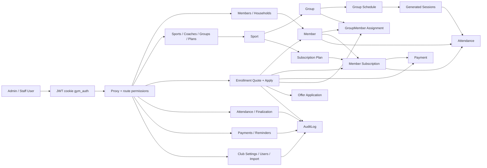

# We Discipline Product Logic Audit

Date: 2026-06-24

Scope:
- Source reviewed: local clone `gymday-app-clone`
- Live server repo reviewed: `/opt/we-discipline` on `178.105.144.196`
- Main live app: `https://we-discipline.com`
- Runtime: Next.js 16, Prisma, SQLite in Docker volume, Docker Compose
- Verification run: `npm test`, `npm run lint`, `npm audit --omit=dev`, server `docker compose ps`

This audit is focused on product logic, loopholes, destructive paths, and sellability risk. It is not a formal penetration test, legal review, accounting review, or GDPR compliance review.

## Executive Verdict

The app has a strong base for a real martial-arts club operations product. The business model is visible in the code: members, households, groups, schedules, sessions, subscriptions, payments, attendance, offers, reminders, and audit logs are all represented. The test suite is unusually useful for this stage: 125 tests passed and many core attendance, subscription, enrollment, offer, and session scenarios are already covered.

However, I would not sell it yet as a paid production product until the critical logic issues below are fixed. The biggest risk is not that the UI is incomplete. The biggest risk is trust: money records, attendance history, sessions, subscriptions, and member history can still be deleted or mutated in ways that can erase evidence or create impossible business states.

The product should move from "admin app that works" to "operations system that protects the club from mistakes."

## Verification Summary

Commands run from `gymday-app-clone`:

| Check | Result |
| --- | --- |
| `npm test` | Passed: 12 files, 125 tests |
| `npm run lint` | Passed |
| `npm audit --omit=dev` | 2 moderate findings from Next bundled PostCSS path |
| Live container | Running as `dojo-saas-app`, bound to `127.0.0.1:3001->3000` |

Important operational note:
- The server repo is dirty and contains deployed changes that are not all in GitHub.
- Server `HEAD` is `06e55c0`, but `/opt/we-discipline` has uncommitted and untracked deployed changes.
- For a product to sell, GitHub must become the source of truth again.

## Logic Net

## Domain Model

The real app logic is built around this chain:

1. `Sport` defines a discipline.
2. `Group` belongs to a sport and coach.
3. `GroupSchedule` defines recurring time slots for a group.
4. `Session` is generated from schedules and becomes the attendance unit.
5. `Member` can be assigned to groups through `GroupMember`.
6. `SubscriptionPlan` defines price, total sessions, validity, and weekly frequency for a sport.
7. `MemberSubscription` grants a member access to a sport for a date window.
8. `Payment` records money against a subscription.
9. `Attendance` records present, absent, or override for a member in a session.
10. `AuditLog` is meant to preserve who did what.

This is the right shape. The weak points are mostly around enforcement consistency and destructive actions.

## What Is Already Strong

- Enrollment quote/apply flow is meaningfully modeled and prevents many bad cases: sport mismatch, capacity issues, member type mismatch, schedule conflict, overpayment, family bundle logic, second discipline offers.
- Attendance creation has good guardrails: active member, non-cancelled/non-finalized session, active subscription, payment policy, group assignment, weekly quota, override reason, recovery checks, and unique attendance per member/session.
- Weekly consumption logic is sophisticated and tested.
- Session edit and postpone paths block changes after attendance exists in many cases.
- Sport and subscription plan delete routes guard against linked records.
- Admin/staff permissions exist and route coverage is mostly consistent.
- Production hardening was improved: localhost-only container port, security headers, no public `X-Powered-By`.
- Data import mode has preview/apply/rollback and refuses rollback after new activity.

## Critical Findings

### C1. Group deletion can erase session and attendance history

Evidence:
- `src/app/api/groups/route.ts:266` deletes all sessions for a group.
- `src/app/api/groups/route.ts:267` deletes the group.
- `prisma/schema.prisma:271` has `Session.group` with `onDelete: Cascade`.
- `prisma/schema.prisma:383` has `Attendance.session` with `onDelete: Cascade`.

Impact:
- Deleting a group can destroy sessions.
- Destroying sessions can destroy attendance records.
- Attendance is business history. It should never disappear from a normal UI action.

Fix:
- Replace group delete with soft deactivation/archiving.
- Block hard delete when any session, attendance, payment, subscription, or audit-relevant dependency exists.
- Keep generated sessions and attendances immutable historical records.
- Add tests: "cannot delete group with sessions", "cannot delete group with attendance", "deactivation preserves history".

Severity: Critical.

### C2. Money records are mutable and deletable

Evidence:
- `src/app/api/payments/route.ts:199` updates payments.
- `src/app/api/payments/route.ts:270` deletes payments.
- `src/app/api/payments/route.ts:50`, `143`, `246` allow any user with `payments.manage`, not just admin.
- Audit logs at `src/app/api/payments/route.ts:116`, `220`, `276` do not include `userId`.

Impact:
- A staff user with payment access can edit/delete money history.
- The dashboard can display "correct" totals based on altered history.
- It is hard to answer "who changed this payment?"

Fix:
- Make payments append-only.
- Replace edit/delete with `PaymentAdjustment` or reversal entries.
- Require admin for destructive financial corrections.
- Require correction reason for every money correction.
- Always write `userId` and before/after details in audit logs.
- Add tests that old payment rows remain and corrections are separate ledger rows.

Severity: Critical.

### C3. Disabled or demoted users can retain access until JWT expiry

Evidence:
- `src/lib/request-user.ts:19` trusts the verified JWT payload.
- `src/lib/request-user.ts:31` `requireAuth` does not reload the user from DB.
- `src/lib/request-user.ts:39` `requireAdmin` trusts the JWT role.
- `src/proxy.ts:55` trusts JWT payload for route access.
- `src/app/api/auth/me/route.ts:15` returns JWT payload without DB re-check.
- Token lifetime is 14 days in `src/lib/auth.ts`.

Impact:
- Disabling a user is not immediate everywhere.
- Demoting an admin may not immediately remove admin-only access where `requireAdmin` is used.
- Permissions are partially refreshed in `requirePermission`, but role and active state are stale.

Fix:
- On every protected request, load `User` from DB and require `isActive = true`.
- Check current DB role in `requireAdmin`.
- Either shorten JWT TTL and use session versioning, or store a `tokenVersion`/`sessionVersion` on the user.
- Update `/api/auth/me` to return the current DB user state.
- Add tests: disabled user cookie cannot access any protected API; demoted admin cookie cannot call admin routes.

Severity: Critical.

### C4. Hard-delete and soft-archive styles are mixed

Evidence:
- Soft archive: `src/app/api/members/route.ts:451` marks member `ARCHIVED` and cancels active subscriptions.
- Hard delete: `src/app/api/members/[id]/route.ts:129` deletes group memberships, then `src/app/api/members/[id]/route.ts:131` deletes the member.
- Subscription hard delete: `src/app/api/member-subscriptions/route.ts:359`.
- Group assignment hard delete: `src/app/api/group-members/route.ts:479` and bulk delete at `src/app/api/group-members/bulk/route.ts:297`.
- Payment hard delete: `src/app/api/payments/route.ts:270`.

Impact:
- The product has no single lifecycle rule.
- A support/admin user can accidentally remove historical facts.
- Docs claim auditability, but routes still allow physical deletion.

Fix:
- Define lifecycle policy:
  - Members: archive only.
  - Groups: deactivate only.
  - Subscriptions: cancel/expire only.
  - Payments: append corrections only.
  - Group assignments: close with `endDate`, never delete if historical.
  - Attendance: correction log, not physical delete after finalization or after a configurable lock window.
- Remove or admin-lock hard delete routes.
- Add migration to preserve deleted state fields where missing.

Severity: Critical.

## High-Risk Business Logic Findings

### H1. Attendance edit/delete paths do not re-run the full create rules

Evidence:
- Attendance create checks membership, subscription, payment, group assignment, overrides, and session state.
- `src/app/api/attendances/route.ts:404` PATCH only blocks completed sessions.
- `src/app/api/attendances/route.ts:620` DELETE only blocks completed sessions.
- `src/app/api/attendances/route.ts:477` resolves active subscription during PATCH, but does not re-check member archived state, active assignment window, payment policy, or cancelled session.
- `src/lib/schemas/attendance.ts` allows `status: "OVERRIDE"` without requiring an override reason on update.

Impact:
- A record can be changed into a status that would not be allowed by the create route.
- Cancelled sessions can still have attendance changed/deleted.
- A present/absent record can be corrected without the same access checks.

Fix:
- Extract a single attendance policy service used by POST/PATCH/DELETE.
- PATCH to `PRESENT` or `ABSENT` must validate the same rules as create.
- PATCH to `OVERRIDE` must require a reason when changing into override.
- PATCH/DELETE must block cancelled and completed sessions unless explicitly reopened.
- Add tests for archived member, cancelled session, expired assignment, unpaid subscription, and missing override reason on PATCH.

Severity: High.

### H2. Group assignment date windows are not enforced consistently

Evidence:
- Attendance POST checks assignment with `groupId`, `memberId`, `status: "ACTIVE"` at `src/app/api/attendances/route.ts:193`, but not `startDate <= sessionDate` and not `endDate >= sessionDate`.
- Session expected-member logic does use date windows through `expectedMemberIdsAtSession`.
- Capacity counts active assignments only, for example `src/app/api/groups/route.ts:96`, not whether they are active for the relevant date.

Impact:
- A future assignment can allow today's check-in.
- An expired assignment can still allow attendance if status remains `ACTIVE`.
- Capacity can be occupied by future or expired assignments.

Fix:
- Define "active assignment at date" as a helper.
- Use it in attendance, capacity, expected members, enrollment, bulk assignment, and dashboard.
- Close assignments with `status: INACTIVE` plus `endDate`; do not rely on status alone.

Severity: High.

### H3. Subscription edits can create impossible states

Evidence:
- `src/app/api/member-subscriptions/route.ts:96` checks member existence but not archived status.
- `src/app/api/member-subscriptions/route.ts:276` updates subscription fields directly.
- `src/app/api/member-subscriptions/route.ts:282` allows amount changes.
- `src/app/api/member-subscriptions/route.ts:283` allows remaining sessions changes.
- No guard ensures updated `amount >= totalPaid`.
- No guard ensures `endDate >= startDate`.
- No guard reconciles group assignments if plan/sport/status changes.

Impact:
- Archived members can receive active subscriptions.
- Amount can be lower than payments already collected.
- Plan/sport changes can make active group assignments incompatible.
- Active group access can remain while subscription is cancelled.

Fix:
- Reject active subscriptions for archived members.
- On amount update, require `amount >= sum(payments)`.
- Validate date order.
- If sport/plan/status changes, reconcile or block active assignments.
- Keep admin adjustment reason and before/after snapshot.

Severity: High.

### H4. Enrollment and group assignment rules are inconsistent

Evidence:
- Single group assignment can auto-create an active subscription without payment at `src/app/api/group-members/route.ts:291`.
- Bulk group assignment requires fully paid subscription at `src/app/api/group-members/bulk/route.ts:192`.
- Bulk assignment finds the first active subscription before filtering by sport at `src/app/api/group-members/bulk/route.ts:171`, then checks sport at `src/app/api/group-members/bulk/route.ts:198`.
- Single assignment reuses or creates a subscription but does not record payment.

Impact:
- Same user action has different business policy depending on which screen/API is used.
- A member with multiple sports can be skipped incorrectly in bulk assignment.
- Active group membership can exist before any payment.

Fix:
- Centralize assignment policy in one service.
- Bulk assignment should filter subscription by `sportId: group.sportId` before choosing a subscription.
- Decide one payment policy:
  - either assignment allowed before payment but check-in blocked;
  - or assignment requires paid/partial payment.
- Make UI/API behavior consistent.

Severity: High.

### H5. Group and schedule edits can break existing history

Evidence:
- Group PATCH changes `sportId`, `coachId`, `capacity`, and `isActive` at `src/app/api/groups/route.ts:220-224`.
- Schedule PATCH directly updates recurring slots at `src/app/api/groups/[id]/schedules/route.ts:321`.
- Schedule DELETE directly deletes recurring slots at `src/app/api/groups/[id]/schedules/route.ts:381`.
- Session route has attendance guards, but schedule route does not.

Impact:
- A group sport can change while members have subscriptions for the previous sport.
- Capacity can be lowered below active members.
- Schedule changes can diverge from already-generated sessions.
- Deleting a schedule can hide why historical sessions existed.

Fix:
- Treat schedules as versioned records with `effectiveFrom`/`effectiveTo`.
- Do not mutate old recurring slots once sessions exist; close the old schedule and create a new one.
- Block capacity below active assignment count for the target date window.
- Block sport changes when subscriptions, assignments, sessions, or attendance exist.

Severity: High.

### H6. Audit log is present but not reliable enough for sale

Evidence:
- `AuditLog` exists in `prisma/schema.prisma:398`.
- Several important paths write audit logs.
- Payment logs lack `userId`.
- Some destructive paths delete records first and only log minimal details.
- Audit is app-level only; deleted records can still remove the data the audit points to.

Impact:
- The app cannot always prove who changed financial/member history.
- The audit log may reference missing entities.

Fix:
- Audit every mutation through a shared helper.
- Include actor, before, after, reason, IP/user agent for high-risk actions.
- For financial records, audit should point to immutable ledger rows, not deleted rows.
- Add tests that every high-risk route writes `userId`.

Severity: High.

## Medium-Risk Findings

### M1. Recovery attendance is ambiguous

Evidence:
- `src/lib/attendance-rules.ts` validates recovery by counting eligible absences and recoveries in the week.
- Recovery attendance is not linked to the specific absence it recovers.
- `listRecoveryCandidatesForSession` hides a member after any recovery that week, while validation can allow multiple recoveries if multiple absences exist.

Impact:
- Recovery logic can become confusing when a member has multiple absences in the same week.

Fix:
- Add `recoveredAttendanceId` or a recovery link table.
- Display exactly which absence was recovered.
- Enforce one recovery per absence.

Severity: Medium.

### M2. Public registration has two sources of truth

Evidence:
- `ClubSettings.allowPublicRegister` exists in `prisma/schema.prisma`.
- Register route uses only `ALLOW_PUBLIC_REGISTER` at `src/app/api/auth/register/route.ts:11`.

Impact:
- Admin settings and runtime behavior can disagree.

Fix:
- Remove the unused DB setting or make register use DB setting plus env kill switch.

Severity: Medium.

### M3. Rate limiting is in-memory

Evidence:
- Login and forgot-password use `src/lib/rate-limit.ts`, backed by in-memory state.

Impact:
- Rate limits reset on deploy/restart.
- Rate limits are not shared if the app runs multiple instances.

Fix:
- Use Redis, database counters, or managed edge rate limiting.
- Add rate limiting to password reset completion too.

Severity: Medium.

### M4. Dashboard numbers depend on mutable upstream records

Evidence:
- Dashboard finance math in `src/lib/dashboard-finance.ts` is reasonable.
- It derives from current payments and active subscriptions.

Impact:
- If payments/subscriptions are edited/deleted, dashboard history changes.

Fix:
- Use immutable payment ledger and subscription snapshots.
- Keep revenue reports tied to ledger entries, not mutable payment totals.

Severity: Medium.

### M5. Logo upload validates MIME type but not file signature

Evidence:
- `src/app/api/club-settings/logo/route.ts` accepts PNG/JPEG/WebP by `file.type`.

Impact:
- Browser-provided MIME type is not enough validation.

Fix:
- Validate magic bytes or decode image server-side.
- Optionally strip metadata and re-encode.

Severity: Low to Medium.

### M6. Duplicate attendance test logs a Prisma error

Evidence:
- Test run passes, but duplicate attendance intentionally emits a Prisma unique constraint error.

Impact:
- Test output looks scary and can hide real failures in CI logs.

Fix:
- Catch known Prisma `P2002` without console noise, or silence the expected error in test.

Severity: Low.

## Operations And Deployment Risks

### O1. Server repo is not source-controlled cleanly

Evidence:
- Server `/opt/we-discipline` is on `06e55c0` but has many uncommitted and untracked deployed changes.
- Marketing/homepage and hardening changes were copied into production manually.

Impact:
- `git pull` alone will not reproduce production.
- Recovery/redeploy becomes risky.
- Another developer cannot safely know what is live.

Fix:
- Commit local/server changes to a branch.
- Push to GitHub.
- Deploy only from Git.
- Tag every production release.

Severity: High.

### O2. SQLite is acceptable for demo/single VPS but weak for a sellable SaaS

Evidence:
- Production Compose uses `DATABASE_URL: file:/app/data/prod.db`.
- Persistent volume is `dojo_data`.

Impact:
- Harder concurrent writes.
- Harder point-in-time recovery.
- Less suitable for multi-tenant growth.

Fix:
- Move sellable production to Postgres.
- Define automated daily backups plus pre-deploy backup.
- Test restore procedure monthly.

Severity: High for SaaS, Medium for single-club beta.

### O3. Moderate dependency advisories remain

Evidence:
- `npm audit --omit=dev` reports 2 moderate findings from `postcss <8.5.10` bundled through Next.
- Audit suggests `npm audit fix --force`, but that would install an old/breaking Next path.

Impact:
- Not a release blocker by itself today, but it should be tracked.

Fix:
- Track Next patch releases.
- Upgrade only through normal test/build path.
- Do not run forced audit fix.

Severity: Medium.

## Recommended Fix Order

### Phase 0: Before Any Paid Customer

1. Stop destructive data loss:
   - Disable group hard delete.
   - Disable member detail hard delete.
   - Disable subscription/payment/group assignment hard delete or convert to archive/cancel/close.
2. Fix auth freshness:
   - DB-check `isActive`, role, and permissions on every protected request.
   - Invalidate sessions on password reset, role change, and deactivation.
3. Fix financial trust:
   - Add actor `userId` to every payment audit log.
   - Require admin + reason for payment corrections.
   - Start moving to append-only payment ledger.
4. Commit and push the live deployed code.
5. Add tests for the three critical failure classes:
   - data cannot disappear;
   - disabled/demoted users cannot act;
   - money corrections are traceable.

### Phase 1: Product Hardening

1. Extract shared domain policy services:
   - attendance policy;
   - assignment policy;
   - subscription policy;
   - financial ledger policy.
2. Use the same policy service from POST/PATCH/DELETE routes.
3. Version group schedules instead of mutating/deleting them.
4. Normalize active assignment date-window checks.
5. Block impossible subscription edits.

### Phase 2: Sellable Operations

1. Move production DB to Postgres.
2. Automate backups and restore verification.
3. Add release tags and rollback docs.
4. Add admin activity report: "money changes", "attendance corrections", "deleted/archived records".
5. Add owner-only permissions for financial corrections and user management.

### Phase 3: Product Polish

1. Improve mobile dashboard/table/card flows.
2. Add receipt/invoice export.
3. Add member communication logs.
4. Add onboarding checklist per club.
5. Add subscription renewal forecasting.

## Suggested Data Invariants

These should become tests and shared service checks:

1. A disabled user cannot access any protected route.
2. A demoted admin cannot call admin routes with an old cookie.
3. A payment is never physically deleted after creation.
4. Payment correction is always a new ledger event with actor and reason.
5. A group with sessions or attendance cannot be hard-deleted.
6. A member with subscriptions, payments, or attendance cannot be hard-deleted.
7. Present/absent attendance requires active member, active assignment on session date, valid subscription on session date, payment policy, and remaining quota.
8. Attendance PATCH to present/absent must pass the same checks as create.
9. Attendance PATCH to override must require a reason.
10. Cancelled/completed sessions cannot be changed unless explicitly reopened.
11. Subscription amount cannot be less than total paid.
12. Subscription end date cannot be before start date.
13. Active subscription cannot belong to an archived member.
14. Group capacity uses assignment windows, not only status.
15. Group schedule changes are effective-dated, not destructive.

## Test Coverage Gaps To Add

Add tests for:

- Group delete is blocked when sessions exist.
- Group delete is blocked when attendance exists.
- Member hard delete route is removed or blocked when history exists.
- Subscription delete is blocked when payments/attendance exist.
- Payment delete creates reversal instead of removing the row.
- Payment audit logs include actor id.
- Disabled user cookie cannot call `requireAuth`, `requirePermission`, or `requireAdmin` routes.
- Demoted admin cookie cannot call `/api/users`, `/api/data-import`, `/api/club-settings`.
- Attendance PATCH rejects cancelled sessions.
- Attendance PATCH to override without reason fails.
- Attendance POST rejects future and expired group assignments.
- Bulk group assignment chooses subscription by group sport.
- Subscription amount below paid total fails.
- Subscription for archived member fails.
- Group sport change with subscriptions/sessions fails.
- Schedule delete with generated sessions fails or closes schedule instead.

## Sellability Decision

Recommended status today:

- Demo: yes.
- Closed beta with one trusted club and manual backups: possible after critical destructive routes are disabled.
- Paid product: not yet.

Minimum paid-release gate:

1. No normal UI/API action can erase historical attendance, payment, subscription, or member facts.
2. Disabled/demoted users lose access immediately.
3. Money changes are append-only and actor-attributed.
4. Production code is committed, pushed, tagged, and redeployable from Git.
5. Backups are automated and restore has been tested.

The app is close enough to be worth hardening. It is not a rewrite. But the next work should be defensive product logic, not more features.
